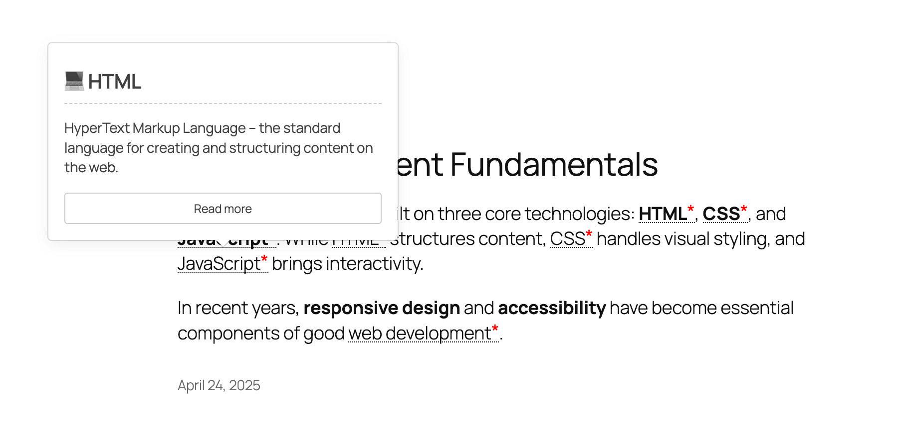

# WP Glossary Tooltip

Glossary Tooltip Plugin allows you to easily create a glossary of terms that automatically highlights and links keywords in your content. When a defined term appears in a post or page, it is highlighted and a tooltip with a short description appears on hover. Users can click the term to navigate to a detailed glossary entry.

### Features
- Create glossary entries with title and description.
- Automatically highlights defined terms across your content.
- Displays tooltips with term descriptions on hover.
- Links each term to its dedicated glossary entry page.
- Define related terms to connect synonyms or words from the same word family.
- Manage all entries from the WordPress admin dashboard.

### Customization Options
The plugin offers various settings to customize how the tooltips appear and behave:

- Choose between multiple tooltip themes.
- Select a tooltip animation style.
- Set the trigger event (e.g. hover or click).
- Define the length of the text preview shown in the tooltip.
- Enable or disable the link to the full glossary entry in the tooltip.

This plugin is perfect for blogs, documentation sites, educational content, or any WordPress website where explaining terms enhances the user experience.



## Table of Contents

* [Getting Started](#getting-started)
* [Gulp Tasks](#gulp-tasks)
* [Folder Structure](#folder-structure)

## Getting Started

To get started with this project, you will need to have Node.js and npm installed on your machine. Once you have these installed, you can install the project dependencies by running the following command:

```bash
npm install
```

## Gulp Tasks
This project uses Gulp to automate tasks. The following tasks are available:

- gulp compileSCSS: Compiles SCSS files and minifies CSS files.<br>
- gulp watch: Watches for changes to SCSS files and recompiles them automatically.

## Folder Structure
The project folder structure is as follows:

- sass: Contains SCSS files.<br>
- css: Contains compiled CSS files.<br>
- vendors: Contains third-party CSS files.<br>
- gulpfile.js: The main Gulp file.<br>
- package.json: The project's npm package file.
